# Session Management Challenge 1
For session management challenges, we will be using Burp Suite. This tool helps us analyze HTTP requests and responses in detail.
## Step 1: Setting Up Burp Suite
1. Open Burp Suite and navigate to the Proxy tab.
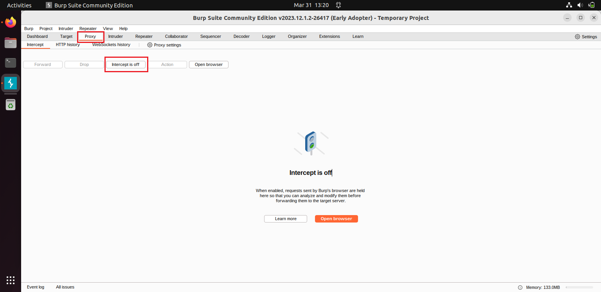
2. Click on Intercept to turn it ON.
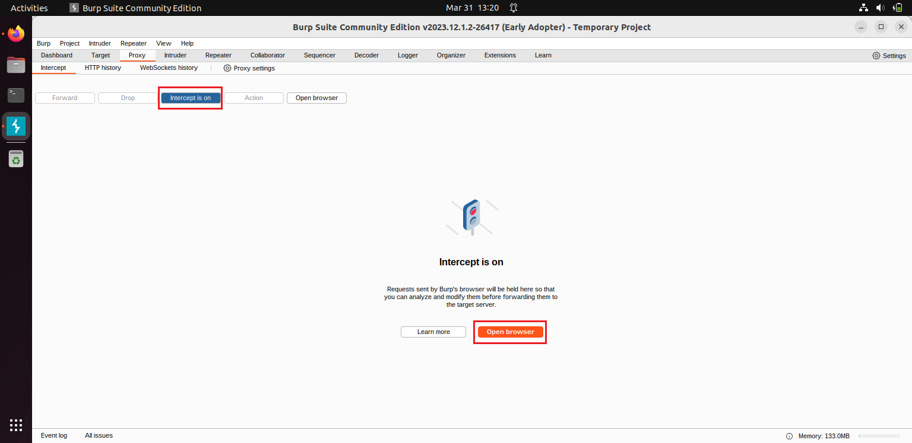
3. Click on Open Browser to launch Burp’s embedded browser.
4. Log in to your Security Shepherd account.
5. Each time you click on a link or button in your browser, make sure to click Forward in Burp Suite’s Intercept tab.
If you don’t forward the request, you’ll see a "Connection failed" page.

## Step 2: Navigating to the Challenge
1. In Security Shepherd, go to the left menu.
2. Click on Challenges → Scroll down to Session Management → Select Challenge 1.
3. You’ll see a button on the page "Administrator button only". Click on it and check Burp Suite to examine the HTTP request.
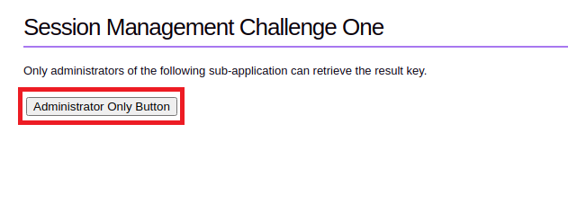

## Step 3: Analyzing the HTTP Request
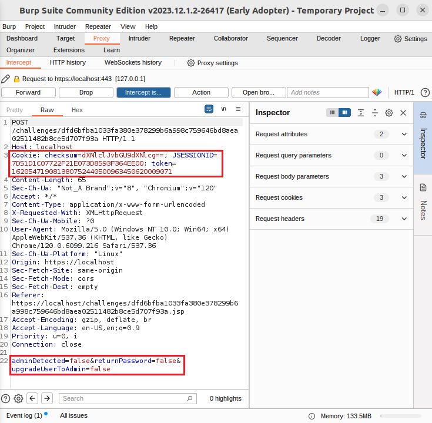
In Burp Suite, you'll notice key details in the request headers, including:
Content-Type: application/x-www-form-urlencoded
> This specifies that form data is sent using the POST method.
Cookies
> - Important values: checksum, JSESSIONID, and token.
Boolean Values
> - At the bottom of the request, you'll see:
`adminDetected=false
returnPassword=false
upgradeUserToAdmin=false`

Understanding Key Parameters
1. Checksum - 
A checksum is a hash used to ensure data integrity and prevent session tampering.

`Example:
Set-Cookie: session_id=12345; checksum=a94a8fe5ccb19ba61c4c0873d391e987`

The checksum is a hash of the session ID. If an attacker modifies session_id, the checksum won’t match, preventing session hijacking.

2. JSESSIONID - 
This is a session identifier used by Java-based web applications.
3. Token - 
A security token, often a JWT (JSON Web Token) or CSRF token, is used for authentication.

## Step 4: Decoding the Checksum
Since the checksum is encoded, we need to determine the encoding technique:

1. Copy the checksum value.
2. Go to Decoder in Burp Suite.
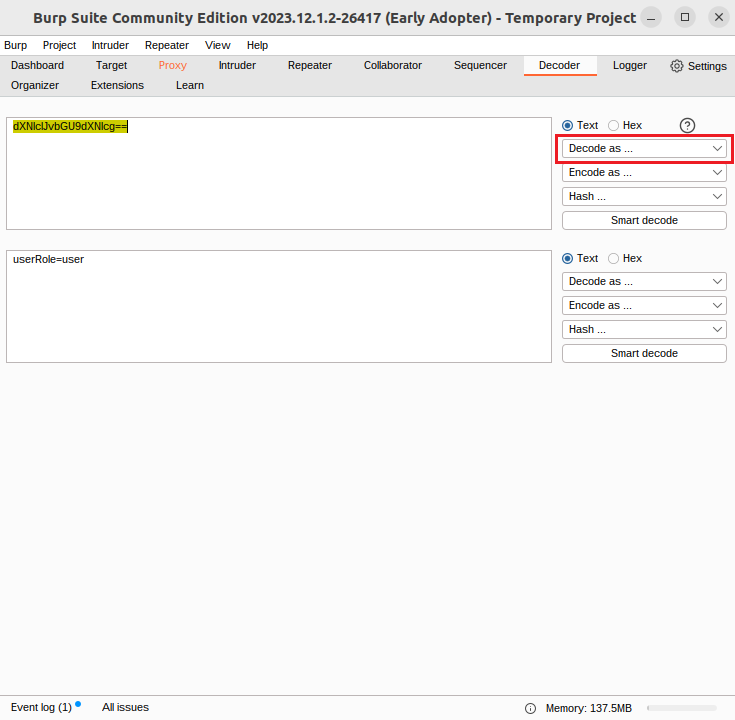
3. Paste the checksum into the box.
4. Click on Decode As, and try different decoding methods.
You’ll find that **Base64** decoding results in something meaningful:

`userRole=user`

## Step 5: Modifying the Role
Now, let's escalate privileges:
1. Change `userRole=user` to `userRole=admin`.
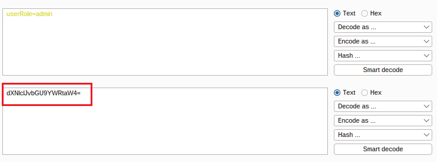
2. Encode it back using Base64.
3. Copy the new encoded value and replace the checksum in the HTTP request header.
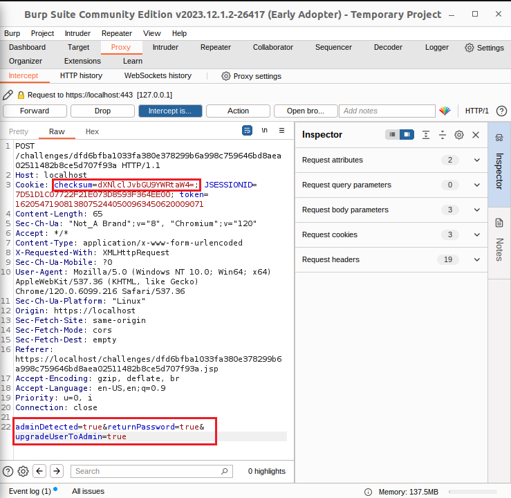
4. Change the boolean values at the bottom to true:

`adminDetected=true
returnPassword=true
upgradeUserToAdmin=true`

5. Click Forward to send the modified request.
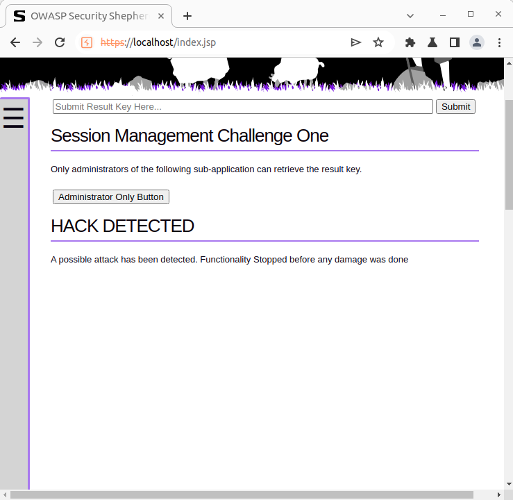

Seems like our hunch wasn’t correct. (sad face emoji)

## Step 6: Debugging & Fixing the Approach
Because admin doesn't work, let's look for clues on the page. The button says,
"Administrator button only".
Let’s try **administrator** instead:
1. Go back to Decoder and modify `userRole=administrator`.
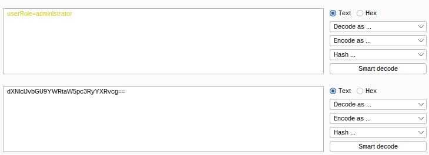
2. Encode it as Base64.
3. Replace the checksum value with this new encoded string.
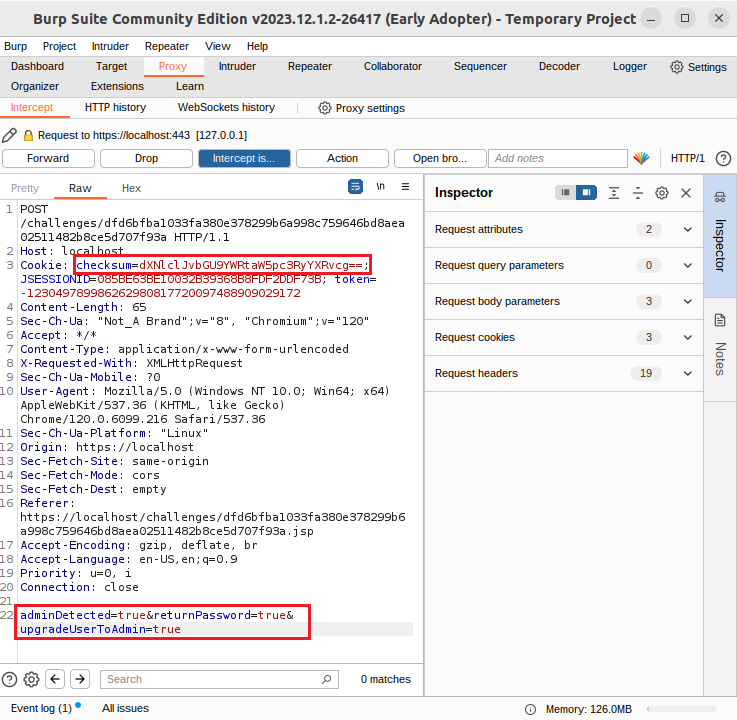
4. Ensure all boolean values are set to true.
5. Click Forward.

Okay, fingers crossed. 
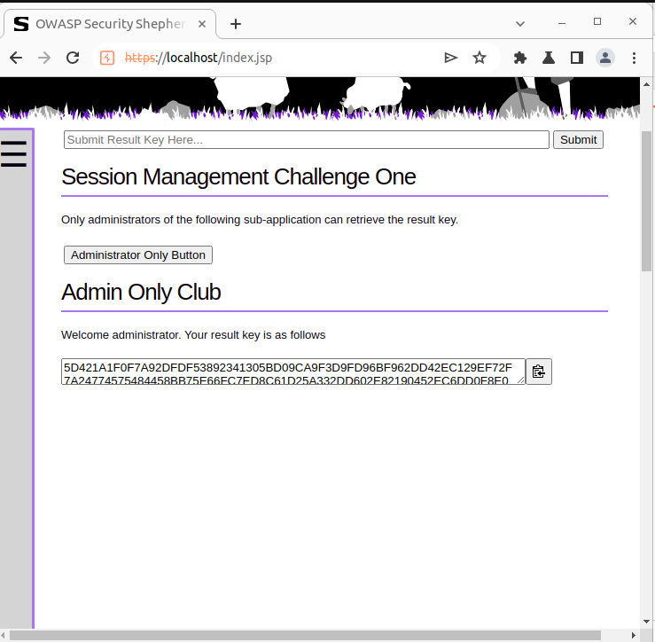
It workkkkkkkked!!!!!! 
Great job guys. You did it!

## Final Step: Completing the Challenge
Copy the result key displayed on the page and paste it into the text box to mark the challenge as completed!
