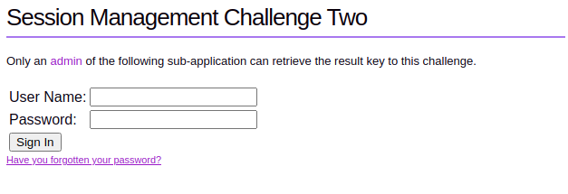
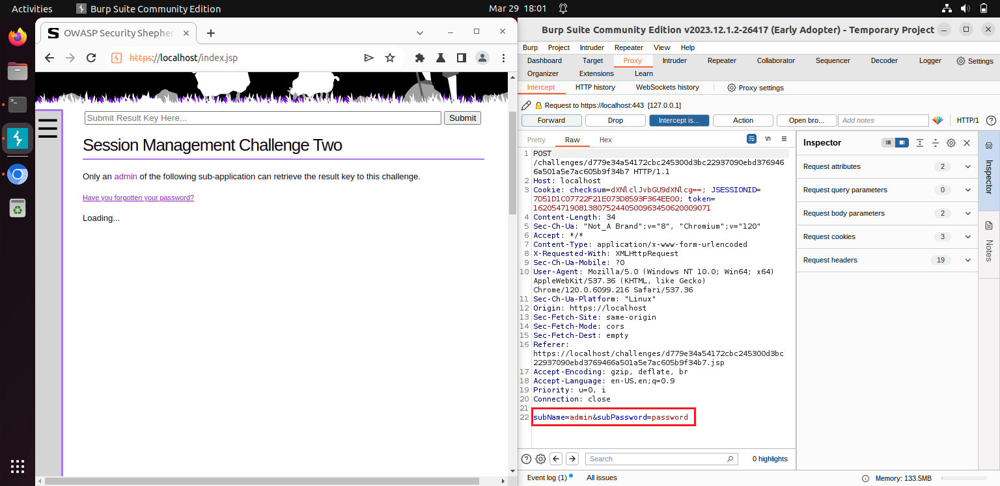
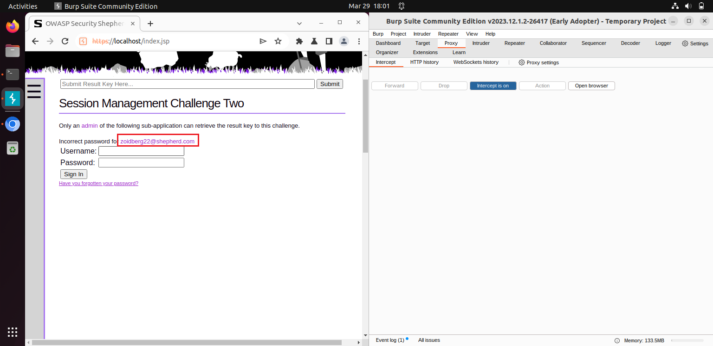
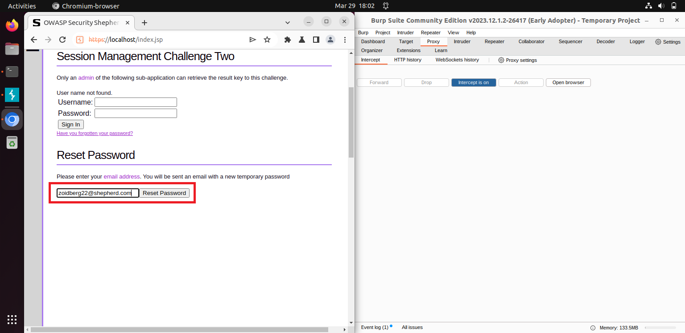
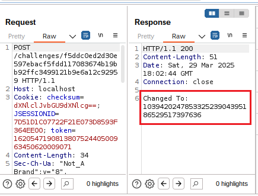
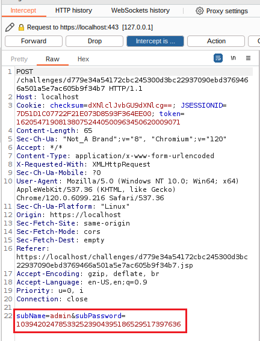
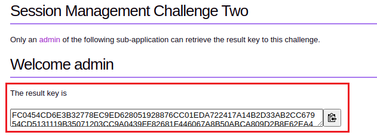

# Session Management Challenge 2
In Challenge 1, we saw how to escalate privileges when only a single button was available. In Challenge 2, we have two fields to work with - **username** and **password**.

Before starting, make sure to set up Burp Suite and launch the browser as we did in Challenge 1.

## Step 1: Trying Common Credentials
The first instinct? Try using:

`Username: admin`

`Password: password`

However, as seen in the screenshot below, this did not work. 

But, we gained useful information - an email address associated with the account. We can now use this to reset the password!

Step 2: Resetting the Password
1. Copy the email address from the error message.

2. Click on **'Have you forgotten the password?'**.

3. Paste the email into the Reset Password field.

4. Click **'Reset Password'**.

## Step 3: Capturing the Password Reset Response
1. In Burp Suite, go to the Proxy tab.

2. Open the HTTP history tab.

3. Look at the most recent request related to password reset.

4. In the response, find the line that says:

> Changed To: < new-password >

5. Copy this updated password.

## Step 4: Logging in with the new password
1. Go back to Security Shepherd’s login page.

2. Enter:

`Username: admin`

`Password: < new-password >` (from Burp Suite response).

3. Click **'Sign In'**.

You can inspect the HTTP request that was sent when logging in (screenshot attached below).

## Step 5: Forwarding the request & getting the result key
In Burp Suite, click **'Forward'** to allow the request.

🎉 Success! We got the result key! 🎉

Copy the key and submit it to complete the challenge.

